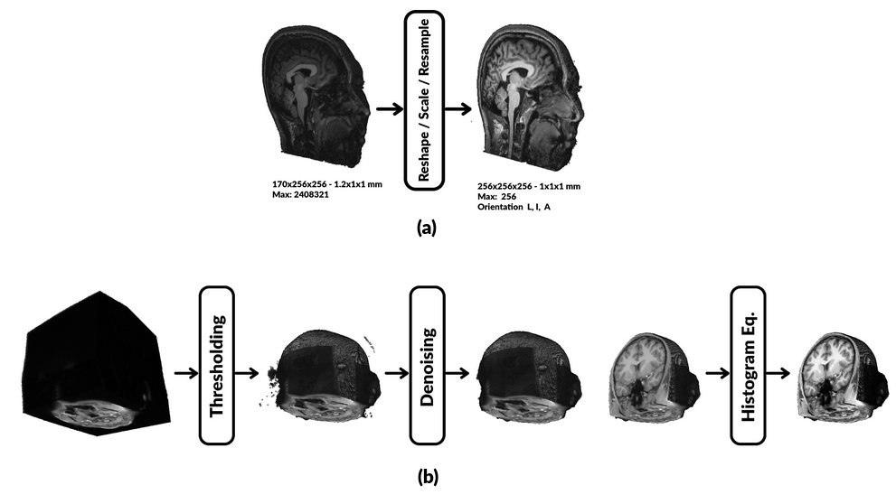

# Summary

[Brainchop](https://github.com/neuroneural/brainchop) is a web-based tool that allows scientists and clinicians to perform volumetric analysis of structural Magnetic Resonance Imaging (MRI) using pre-trained deep learning models, without the need for technical expertise or setup of AI solutions. It is the first browser-based front-end MRI segmentation tool that can process full brain volumes in a single pass, using the lightweight and reliable Meshnet model [@Fedorov:2017] modified to incorporate volumetric dilated convolutions [@Yu:2016] for increased accuracy and modest computational requirements. In addition to offering extensibility through an open-source framework, Brainchop also addresses privacy concerns by performing client-side processing and leveraging hardware acceleration across different brands and architectures.

# Statement of needs

Accurate segmentation of brain tissue from MRI volumes is a crucial step in various brain imaging analysis pipelines, with applications ranging from surgical planning and measurement of brain changes to visualization of anatomical structures. However, few professionals possess both domain expertise and machine learning skills, as well as the necessary computational infrastructure, to take advantage of the benefits of artificial intelligence (AI)-assisted neuroimaging. This limitation is particularly pronounced in rural areas and developing countries. To address these challenges, we developed brainchop, an in-browser machine learning platform for volumetric neuroimaging that offers high accessibility, scalability, low latency, ease of use, lack of installation requirements, and cross-platform operation while also preserving end-user data privacy. Unlike traditional web applications, brainchop operates within the browser environment, avoiding the need for server-side processing and the associated privacy and portability issues.

# Pipeline

In order to deploy the PyTorch MeshNet model in the browser, there is a  need to convert it first to tensorflow.js model (tfjs) [@tensorflow-js]. Brainchop has a pre-processing pipeline, full-volume and sub-volumes inference options, 3D input/output rendering, and post-processing capability as illustrated in \autoref{fig:Brainchop-Pipleline} for the tool high-level architecture.

# Preprocessing

Brainchop is designed to support T1 weighted MRI volume segmentation. The input is read in Nifti format [@NIfTI-Reader]. T1 image needs to be in shape 256x256x256, scaled, and resampled to 1mm isotropic voxels as a preprocessing step for proper results. This preprocessing can be made in brainchop by using mri_convert.js which uses pyodide [@pyodide_2022] to deploy the conform function used by FastSurfer [@Henschel:2020] for reshaping, scaling, and re-sampling  MRI T1 raw image data as shown in  \autoref{fig:Convert-Enhance-Pipeline} (a).

The rest of the preprocessing pipeline is to remove input noisy voxels and enhance input volume intensities to improve the segmentation accuracy \autoref{fig:Convert-Enhance-Pipeline} (b). In addition, brainchop also supports  MRI tissue cropping to speed up the inference process and lowering memory use. 

# Inference Model

The advantage of MeshNet small size is due to its simple architecture and using dilated convolution in which a typical model for the segmentation task can be constructed with few layers as shown in \autoref{fig:MeshNet-Arch}.

While MeshNet Model has fewer parameters compared to the classical segmentation model U-Net, it is also can achieve a competitive DICE score as shown in \autoref{tab:Table-1}.

\begin{table}[h] \centering \caption{\label{tab:Table-1} Segmentation models performance.}  \begin{tabular}{l|ccc} \hline  {\bf Model} & {\bf Inference Speed} & {\bf Model Size} & {\bf Macro DICE} \\\hline MeshNet GMWM & 116 subvolumes/sec & .89 mb & 0.96 \\ U-Net GMWM & 13  subvolumes/sec &  288 mb & 0.96 \\ MeshNet GMWM (full brain model) & 0.001 sec/volume &  0.022 mb & 0.96\\\hline \end{tabular} \end{table}

# Results

Multiple pre-trained models are available with brainchop for full-volume and sub-volume inference including brain masking, gray matter white matter (GMWM) segmentation models, in addition to brain atlas models for 50 cortical regions and 104 cortical and sub-cortical structures as shown in \autoref{fig:Gallery-1}.

Normally 3D noisy regions may result from the inference process due to possible bias, variance and irreducible error (e.g. noise with data). To remove these noisy volumes we designed a 3D connected components algorithm to filter out those noisy regions. 

Papaya [@Papaya] viewers is used to visualize the input and output images, and a composite operation also provided to subjectively verify the output image accuracy comparing to the input. 

Also, brainchop supports 3D real-time rendering of the input and output volume by using Three.js [@threejs] with capability of Region of Interest (ROI) selection as shown in \autoref{fig:rendering}.

# Code availability

The source code is publicly accessible in a GitHub repository ([https://github.com/neuroneural/brainchop](https://github.com/neuroneural/brainchop)) with detailed step-by-step [documentation](https://github.com/neuroneural/brainchop/wiki). Built-in models also are provided with brainchop  [live demo](https://neuroneural.github.io/brainchop/).  

# Acknowledgments

This work was funded by the NIH grant RF1MH121885. Additional support from NIH R01MH123610, R01EB006841 and NSF 2112455.

# References

