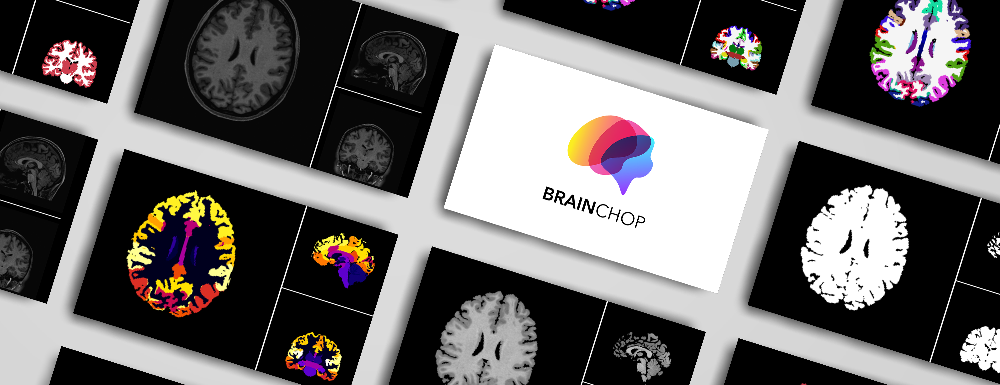
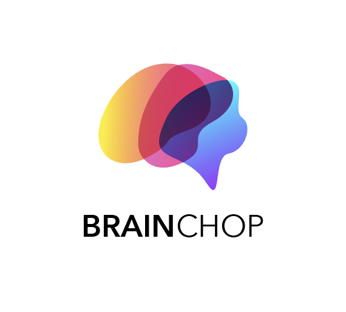

# Brainchop      

  

**Frontend For Neuroimaging.  Open Source**

**[Demo v3](https://neuroneural.github.io/brainchop/v3) &emsp; [Doc](https://github.com/neuroneural/brainchop/wiki/)**

 
 

 

 <b><a href="https://neuroneural.github.io/brainchop/v3"  style="text-decoration: none"> Brainchop v3</a></b> brings automatic 3D MRI  volumetric segmentation  capability to neuroimaging  by running a lightweight deep learning model (e.g., <a href="https://medium.com/pytorch/catalyst-neuro-a-3d-brain-segmentation-pipeline-for-mri-b1bb1109276a" target="_blank"  style="text-decoration: none"> MeshNet</a>) in the web-browser for inference on the user side. 
 

 

 We make the implementation of Brainchop freely available, releasing its pure javascript code as open-source. The user interface (UI)  provides a web-based end-to-end solution for 3D MRI segmentation. <b><a href="https://rii-mango.github.io/Papaya/"  style="text-decoration: none">Papaya</a></b> viewer is integrated with the tool for MRI visualization. In version 1.3.0, <b><a href="https://threejs.org/"  style="text-decoration: none">Three.js</a></b> is used for MRI 3D rendering.  For more information about Brainchop, please refer to this detailed <b><a href="https://github.com/neuroneural/brainchop/wiki/"  style="text-decoration: none">Wiki</a></b> and this <b><a href="https://trendscenter.org/in-browser-3d-mri-segmentation-brainchop-org/"  style="text-decoration: none"> Blog</a></b>.

  
 

  

> **Note:** The remaining content of this README file has been moved to the main [README.md](../README.md) file in the root of the repository. Please refer to the main README for general information, last updates, news,  citations, usage guidelines, and contribution details.

 

</img>

**Mohamed Masoud - Sergey Plis - 2024**

